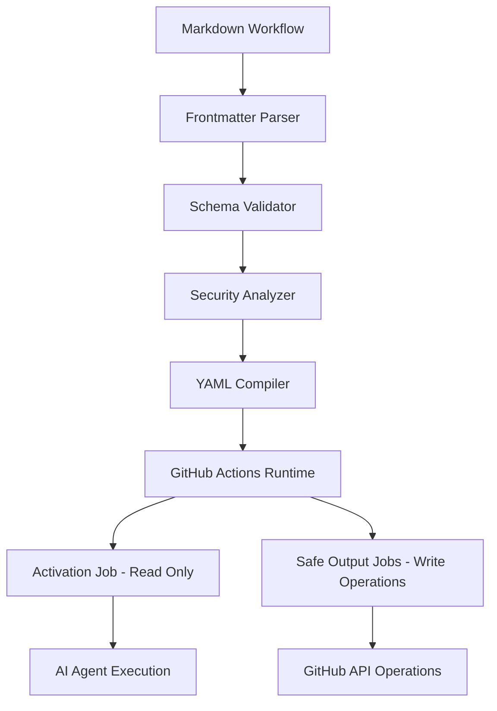
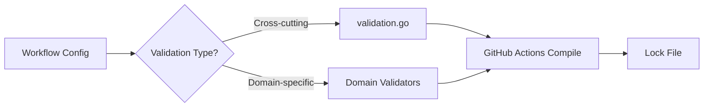
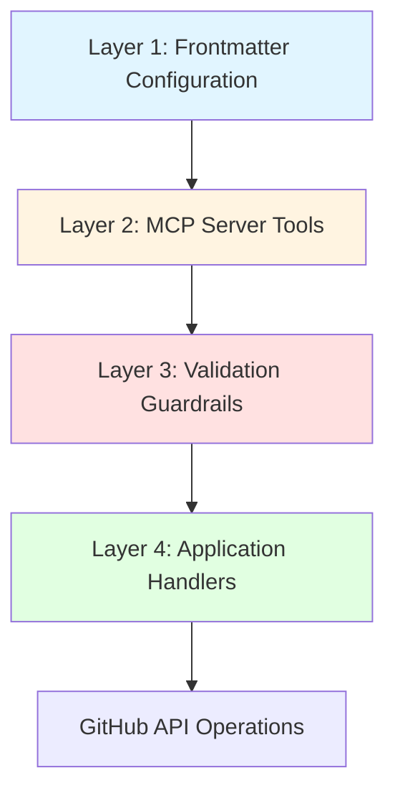

# Developer Instructions

This document consolidates specifications and implementation guidance for GitHub Agentic Workflows from the `scratchpad/` directory. It provides architectural patterns, testing practices, security guidelines, and code organization principles for contributors.

## Table of Contents

- [Core Architecture](#core-architecture)
- [Code Organization](#code-organization)
- [Validation System](#validation-system)
- [Safe Outputs System](#safe-outputs-system)
- [Testing Guidelines](#testing-guidelines)
- [Security Best Practices](#security-best-practices)
- [Go Type Patterns](#go-type-patterns)
- [CLI Command Patterns](#cli-command-patterns)
- [Workflow Refactoring](#workflow-refactoring)
- [Performance Optimization](#performance-optimization)
- [MCP Integration](#mcp-integration)
- [Quick Reference](#quick-reference)

---

## Core Architecture

### System Layers

GitHub Agentic Workflows implements a multi-layered architecture separating AI reasoning from write operations:



**Key Components:**

1. **Frontmatter Parser** (`pkg/parser/frontmatter.go`)
   - Parses YAML frontmatter from markdown workflow files
   - Validates configuration schema
   - Reference: `scratchpad/schema-validation.md`

2. **Workflow Compiler** (`pkg/workflow/compiler.go`)
   - Transforms markdown workflows into GitHub Actions YAML
   - Handles expression translation
   - Reference: `scratchpad/yaml-version-gotchas.md`

3. **Safe Outputs System** (`pkg/workflow/safe_outputs.go`)
   - Four-layer security architecture (frontmatter, MCP, guardrails, handlers)
   - Enforces read-only AI execution
   - Reference: `scratchpad/safe-outputs-specification.md`

4. **AI Engines** (`pkg/workflow/*_engine.go`)
   - `copilot_engine.go` - GitHub Copilot integration
   - `claude_engine.go` - Anthropic Claude integration
   - `codex_engine.go` - OpenAI Codex integration
   - `custom_engine.go` - Custom engine support

### Architecture Principles

- **Security Through Separation**: AI agents operate with read-only access; write operations execute in isolated jobs with explicit permissions
- **Least Privilege**: Each operation receives only the minimum permissions required
- **Defense Against Injection**: Structured output format prevents command injection and template attacks
- **Fail-Safe Defaults**: Conservative defaults protect against misconfiguration

---

## Code Organization

### File Organization Patterns

Reference: `scratchpad/code-organization.md`

#### Create Functions Pattern

One file per GitHub entity creation operation:

**Examples:**
- `create_issue.go` - GitHub issue creation logic
- `create_pull_request.go` - Pull request creation logic
- `create_discussion.go` - Discussion creation logic
- `create_code_scanning_alert.go` - Code scanning alert creation

**When to use:**
- Creating handlers for GitHub API operations
- Implementing safe output processors
- Building distinct feature modules

**Benefits:**
- Clear separation of concerns
- Quick location of specific functionality
- Prevents files from becoming too large
- Facilitates parallel development

#### Engine Separation Pattern

Each AI engine has its own file with shared helpers in `engine_helpers.go`:

**Examples:**
- `copilot_engine.go` (971 lines) - GitHub Copilot engine
- `claude_engine.go` (340 lines) - Claude engine
- `codex_engine.go` (639 lines) - Codex engine
- `engine_helpers.go` (424 lines) - Shared engine utilities

**When to use:**
- Implementing new AI engines
- Adding engine-specific features
- Refactoring engine functionality

#### Expression Builder Pattern

Cohesive functionality organized in a single, focused file:

**Examples:**
- `expressions.go` (948 lines) - Expression tree building and rendering
- `strings.go` (153 lines) - String utility functions
- `artifacts.go` (60 lines) - Artifact handling

**When to use:**
- Building domain-specific utilities
- Implementing self-contained features
- Creating reusable components

### File Size Guidelines

Reference: `scratchpad/code-organization.md`, `scratchpad/validation-refactoring.md`

**Target Ranges:**

| File Type | Target Lines | Maximum Lines | Action Required |
|-----------|--------------|---------------|-----------------|
| Handler files | 100-300 | 500 | Split if exceeding max |
| Validator files | 200-400 | 600 | Refactor into domain-specific files |
| Engine files | 300-500 | 1000 | Extract shared logic to helpers |
| Utility files | 50-200 | 400 | Split by functional area |

**When to refactor:**
- ✅ File exceeds maximum lines
- ✅ File has 3+ distinct responsibilities
- ✅ Difficulty understanding file purpose
- ✅ Frequent merge conflicts
- ✅ Tests becoming unwieldy

---

## Validation System

### Validation Architecture

Reference: `scratchpad/validation-architecture.md`

The validation system ensures workflow configurations are correct, secure, and compatible before compilation. Validation is organized into two patterns:



#### Centralized Validation: `validation.go`

**Location**: `pkg/workflow/validation.go` (782 lines)

**Purpose**: General-purpose validation applying across the entire workflow system

**Functions:**
- `validateExpressionSizes()` - Ensures GitHub Actions expression size limits
- `validateContainerImages()` - Verifies Docker images exist and are accessible
- `validateGitHubActionsSchema()` - Validates against GitHub Actions YAML schema
- `validateSecretReferences()` - Validates secret reference syntax
- `validateRepositoryFeatures()` - Checks repository capabilities (issues, discussions)

**When to add validation here:**
- ✅ Cross-cutting concerns spanning multiple domains
- ✅ Core workflow integrity checks
- ✅ GitHub Actions compatibility validation
- ✅ General schema and configuration validation

#### Domain-Specific Validation

Organized into separate files based on functional area:

**1. Strict Mode Validation**: `strict_mode_validation.go`
- Enforces security and safety constraints in strict mode
- `validateStrictPermissions()` - Refuses write permissions
- `validateStrictNetwork()` - Requires explicit network configuration
- `validateStrictBashTools()` - Refuses bash wildcard tools

**2. Python Package Validation**: `pip.go`
- Validates Python package availability on PyPI
- `validatePipPackages()` - Validates pip packages
- `validateUvPackages()` - Validates uv packages

**3. NPM Package Validation**: `npm.go`
- Validates NPX package availability on npm registry
- `validateNpxPackages()` - Validates npm packages used with npx

**4. Expression Safety**: `expression_safety.go`
- Validates GitHub Actions expression security
- `validateExpressionSafety()` - Validates allowed GitHub expressions
- Prevents injection attacks

### Validation Refactoring Guidelines

Reference: `scratchpad/validation-refactoring.md`

**When to split a validation file:**

1. File exceeds 600 lines
2. Contains 3+ distinct validation domains
3. Requires extensive scrolling to understand
4. Tests exceed 400 lines

**Refactoring process:**

1. Identify validation domains (e.g., permissions, bash, network)
2. Create `*_validation.go` files for each domain
3. Move domain functions and tests to new files
4. Update import statements
5. Run tests to verify no regressions
6. Update documentation

---

## Safe Outputs System

### Architecture Overview

Reference: `scratchpad/safe-outputs-specification.md`, `scratchpad/safe-output-messages.md`

The Safe Outputs System enables AI agents to request write operations without possessing write permissions through a four-layer architecture:



**Layer 1: Frontmatter Configuration**
- Workflow author declares `safe-outputs:` in YAML
- Defines limits, permissions, and constraints
- Compiled into GitHub Actions workflow

**Layer 2: MCP Server Tools**
- AI agent calls MCP tools during read-only execution
- Tools produce structured NDJSON output (not actual operations)
- Logged to artifact for downstream processing

**Layer 3: Validation Guardrails**
- Safe output job reads NDJSON artifact
- Validates against limits and constraints
- Sanitizes text, checks field sizes
- Enforces configured maximums

**Layer 4: Application Handlers**
- Executes validated operations via GitHub API
- Handles error recovery and retries
- Logs all actions for auditability

### Builtin System Tools

Reference: `scratchpad/safe-outputs-specification.md`

**1. `missing_tool` - Report Missing Capability**

Used when a tool or capability needed to complete the task is not available.

**2. `missing_data` - Report Missing Information**

Used when data or information needed to complete the task is not available.

**3. `noop` - Log Transparency Message**

Used when no significant actions are needed but workflow must produce output.

### Environment Variables

Reference: `scratchpad/safe-output-environment-variables.md`

Common variables required for all safe output jobs:

- `GITHUB_TOKEN` - GitHub API authentication token
- `GITHUB_REPOSITORY` - Repository name (owner/repo)
- `GH_WORKFLOW_RUN_ID` - Workflow run identifier
- `GH_WORKFLOW_ACTOR` - User who triggered workflow

Job-specific variables vary by operation type (issues, PRs, discussions, etc.).

---

## Testing Guidelines

### Test Organization

Reference: `scratchpad/testing.md`

Tests are co-located with implementation files:

- **Unit tests**: `feature.go` + `feature_test.go`
- **Integration tests**: `feature_integration_test.go` (marked with `//go:build integration`)
- **Security tests**: `feature_security_regression_test.go`
- **Fuzz tests**: `feature_fuzz_test.go`

### Assert vs Require

Use **testify** assertions appropriately:

**`require.*`** - For critical setup steps that make the test invalid if they fail
- Stops test execution immediately on failure
- Use for: creating test files, parsing input, setting up test data

**`assert.*`** - For actual test validations
- Allows test to continue checking other conditions
- Use for: verifying behavior, checking output values, testing multiple conditions

**Example:**

``````go
func TestSafeOutputsConfiguration(t *testing.T) {
    // Setup - use require
    tmpDir := t.TempDir()
    testFile := filepath.Join(tmpDir, "test.md")
    err := os.WriteFile(testFile, []byte(markdown), 0644)
    require.NoError(t, err, "Failed to write test file")

    // Parse - use require (critical for test to continue)
    workflowData, err := compiler.ParseWorkflowFile(testFile)
    require.NoError(t, err, "Failed to parse markdown content")
    require.NotNil(t, workflowData.SafeOutputs)

    // Verify - use assert (actual test validations)
    assert.Equal(t, expectedValue, actualValue)
    assert.Contains(t, output, "expected text")
}
``````

### Table-Driven Tests

Use table-driven tests with `t.Run()` for testing multiple scenarios:

``````go
func TestValidator(t *testing.T) {
    tests := []struct {
        name     string
        input    string
        expected error
    }{
        {
            name:     "valid input",
            input:    "valid",
            expected: nil,
        },
        {
            name:     "invalid input",
            input:    "",
            expected: ErrEmptyInput,
        },
    }

    for _, tt := range tests {
        t.Run(tt.name, func(t *testing.T) {
            err := Validate(tt.input)
            assert.Equal(t, tt.expected, err)
        })
    }
}
``````

**Key principles:**
- Use descriptive test case names
- Structure: Define test cases → Loop with `t.Run()` → Test logic
- Each sub-test runs independently

### Visual Regression Testing

Reference: `scratchpad/visual-regression-testing.md`

Use golden files for CLI output testing:

**Location**: `pkg/cli/testdata/golden/`

**Pattern:**
1. Test generates output
2. Compare against golden file
3. Update golden file when output legitimately changes

**Commands:**
- Run tests: `go test ./pkg/cli/...`
- Update golden files: `go test ./pkg/cli/... -update`

---

## Security Best Practices

### GitHub Actions Security

Reference: `scratchpad/github-actions-security-best-practices.md`, `scratchpad/template-injection-prevention.md`

#### Template Injection Prevention

**Vulnerable Pattern** ❌

``````yaml
- name: Comment on PR
  run: |
    echo "Comment from ${{ github.event.comment.body }}"
``````

**Safe Pattern** ✅

``````yaml
- name: Comment on PR
  env:
    COMMENT_BODY: ${{ github.event.comment.body }}
  run: |
    echo "Comment from $COMMENT_BODY"
``````

**Key principles:**
- Never interpolate untrusted input directly into scripts
- Use environment variables for user-controlled data
- Sanitize and validate all external inputs
- Apply principle of least privilege to permissions

#### Shell Script Best Practices

1. **Use explicit interpreters**: `bash -euo pipefail`
2. **Quote variables**: `"$VAR"` not `$VAR`
3. **Validate inputs**: Check format and content
4. **Avoid dynamic command construction**: Use fixed commands with variable arguments

#### Permissions

**Minimal permissions pattern:**

``````yaml
permissions:
  contents: read      # Repository content (read-only)
  issues: write       # Issue creation only
  pull-requests: none # No PR access
``````

**Strict mode** (recommended for AI workflows):

``````yaml
strict-mode: true
permissions:
  contents: read
  issues: read
  pull-requests: read
network:
  hosts:
    - "api.github.com"
``````

### Secret Scanning

Reference: `scratchpad/security_review.md`

**Common false positives:**
- GitHub Actions context variables: `${{ github.token }}`
- Workflow expressions: `${{ secrets.GITHUB_TOKEN }}`
- Artifact paths containing "secret" or "token"

**Validation methodology:**
1. Trace data flow from source to sink
2. Verify sanitization at each step
3. Check for direct interpolation into shell commands
4. Validate against template injection patterns

---

## Go Type Patterns

### Constants Organization

Reference: `scratchpad/go-type-patterns.md`, `scratchpad/capitalization.md`

**Location**: `pkg/constants/constants.go`

**Patterns:**

``````go
// Use type-safe constants with string types
type WorkflowStatus string

const (
    WorkflowStatusPending   WorkflowStatus = "pending"
    WorkflowStatusRunning   WorkflowStatus = "running"
    WorkflowStatusCompleted WorkflowStatus = "completed"
    WorkflowStatusFailed    WorkflowStatus = "failed"
)

// Provide validation function
func (s WorkflowStatus) IsValid() bool {
    switch s {
    case WorkflowStatusPending, WorkflowStatusRunning,
         WorkflowStatusCompleted, WorkflowStatusFailed:
        return true
    default:
        return false
    }
}
``````

### Error Handling

**Define package-specific errors:**

``````go
var (
    ErrInvalidWorkflow = errors.New("invalid workflow configuration")
    ErrMissingRequired = errors.New("missing required field")
    ErrValidationFailed = errors.New("validation failed")
)

// Wrap errors with context
func ValidateWorkflow(w *Workflow) error {
    if w.Name == "" {
        return fmt.Errorf("%w: name is required", ErrMissingRequired)
    }
    return nil
}
``````

### String Sanitization vs Normalization

Reference: `scratchpad/string-sanitization-normalization.md`

**Sanitization** - Removes or escapes dangerous characters for security

``````go
// For user input going into shell commands
func SanitizeShellArg(s string) string {
    // Remove shell metacharacters
    return shellquote.Quote(s)
}

// For GitHub API field values
func SanitizeGitHubText(s string) string {
    // Remove control characters, validate UTF-8
    return removeControlChars(s)
}
``````

**Normalization** - Transforms to canonical form for comparison

``````go
// For case-insensitive comparison
func NormalizeLabel(s string) string {
    return strings.ToLower(strings.TrimSpace(s))
}

// For path comparison
func NormalizePath(s string) string {
    return filepath.Clean(strings.ReplaceAll(s, "\\", "/"))
}
``````

**Use case matrix:**

| Scenario | Function Type | Example |
|----------|---------------|---------|
| User input → Shell command | Sanitization | `SanitizeShellArg()` |
| User input → GitHub API | Sanitization | `SanitizeGitHubText()` |
| Label comparison | Normalization | `NormalizeLabel()` |
| Path comparison | Normalization | `NormalizePath()` |
| URL comparison | Normalization | `NormalizeURL()` |

---

## CLI Command Patterns

Reference: `scratchpad/cli-command-patterns.md`, `scratchpad/breaking-cli-rules.md`

### Command Structure

``````go
var myCmd = &cobra.Command{
    Use:   "command [args]",
    Short: "Brief description",
    Long:  "Detailed description with examples",
    Args:  cobra.ExactArgs(1),
    RunE: func(cmd *cobra.Command, args []string) error {
        // Implementation
        return nil
    },
}
``````

### Flag Patterns

**String flags:**

``````go
var flagName string
cmd.Flags().StringVar(&flagName, "name", "", "Description")
``````

**Boolean flags:**

``````go
var flagVerbose bool
cmd.Flags().BoolVar(&flagVerbose, "verbose", false, "Enable verbose output")
``````

**Required flags:**

``````go
cmd.Flags().StringVar(&flagRequired, "required", "", "Required flag")
cmd.MarkFlagRequired("required")
``````

### Output Styling

Reference: `scratchpad/styles-guide.md`

Use the `styles` package for consistent terminal output:

``````go
import "github.com/github/gh-aw/pkg/styles"

// Success message
fmt.Fprintln(w, styles.Success("✓ Operation completed"))

// Error message
fmt.Fprintln(w, styles.Error("✗ Operation failed"))

// Warning
fmt.Fprintln(w, styles.Warning("⚠ Warning message"))

// Info
fmt.Fprintln(w, styles.Info("ℹ Info message"))

// Code/path
fmt.Fprintf(w, "File: %s\n", styles.Code("path/to/file"))
``````

### Breaking Changes

Reference: `scratchpad/breaking-cli-rules.md`

**When breaking changes are allowed:**

1. **Major version bumps** (1.x → 2.x)
2. **Documented deprecation period** (minimum 2 minor versions)
3. **Clear migration path** provided in docs
4. **Runtime warnings** before removal

**Deprecation pattern:**

``````go
// Deprecated: Use NewFunctionName instead. Will be removed in v2.0.0.
func OldFunction() {
    fmt.Fprintln(os.Stderr, "Warning: OldFunction is deprecated, use NewFunction")
    NewFunction()
}
``````

---

## Workflow Refactoring

### Size Guidelines

Reference: `scratchpad/workflow-refactoring-patterns.md`

**Target ranges:**

| Workflow Type | Target Lines | Maximum Lines | Action |
|---------------|--------------|---------------|--------|
| Simple workflow | 50-150 | 300 | Consider refactoring |
| Standard workflow | 150-400 | 600 | Should refactor |
| Complex workflow | 400-800 | 1000 | Must refactor |

**Refactoring triggers:**

1. ✅ Workflow exceeds 600 lines
2. ✅ Contains 3+ distinct responsibilities
3. ✅ Duplicated instruction blocks
4. ✅ Difficult to understand workflow purpose
5. ✅ Testing requires multiple scenarios

### Refactoring Patterns

**Pattern 1: Extract Shared Instructions**

Create `.github/agents/*.agent.md` files for reusable instructions:

``````yaml
---
description: GitHub API Best Practices
applyTo: "**/*"
---

## GitHub API Guidelines

- Use appropriate rate limiting
- Handle pagination for large result sets
- Implement exponential backoff for retries
``````

**Pattern 2: Module Composition**

Break large workflows into focused modules:

``````markdown
Original: mega-workflow.md (800 lines)
  ↓
Refactored:
  - core-workflow.md (200 lines)
  - data-processing-module.md (150 lines)
  - reporting-module.md (150 lines)
``````

**Pattern 3: Conditional Inclusion**

Use `applyTo` in agent files to target specific workflows:

``````yaml
---
description: Testing Guidelines
applyTo: "**/test-*.md"
---
``````

---

## Performance Optimization

### Token Budget Management

Reference: `scratchpad/token-budget-guidelines.md`

**Configuration:**

``````yaml
token-budget:
  total: 100000        # Maximum tokens per workflow run
  warning: 80000       # Warning threshold (80%)
  model-limits:
    gpt-4: 8000
    gpt-3.5-turbo: 4000
``````

**Optimization strategies:**

1. **Reduce context size**: Only include relevant agent instructions
2. **Use cheaper models**: GPT-3.5-turbo for simple tasks
3. **Implement caching**: Cache expensive API responses
4. **Optimize prompts**: Remove verbose instructions
5. **Limit iterations**: Set `max-turns` appropriately

**Monitoring:**

- Track token usage in workflow runs
- Alert when exceeding warning threshold
- Analyze token consumption patterns

### MCP Server Optimization

Reference: `scratchpad/serena-tools-analysis.md`, `scratchpad/serena-tools-quick-reference.md`

**High-frequency tools** (optimize these first):

1. `find_symbol` - Symbol search and retrieval
2. `get_symbols_overview` - File symbol summaries
3. `find_referencing_symbols` - Reference tracking

**Optimization techniques:**

- Cache symbol lookups
- Batch related operations
- Use `include_body: false` when body not needed
- Limit `depth` parameter to minimum required

---

## MCP Integration

### MCP Configuration

Reference: `scratchpad/github-mcp-access-control-specification.md`

**Builtin MCP servers:**

``````yaml
mcp:
  github:
    enabled: true
    permissions:
      repositories: read
      issues: read
      pull-requests: read
``````

**Custom MCP servers:**

``````yaml
mcp:
  custom-servers:
    - name: my-server
      command: npx
      args: ["-y", "@my-org/mcp-server"]
      network:
        enabled: true
        hosts:
          - "api.example.com"
``````

**Network restrictions:**

``````yaml
network:
  enabled: true
  hosts:
    - "api.github.com"
    - "api.anthropic.com"
  allow-http: false  # HTTPS only
``````

### Safe Job Configuration

Reference: `scratchpad/safe-outputs-specification.md`

**Custom safe jobs:**

``````yaml
safe-outputs:
  limits:
    max-issues: 5
    max-comments: 10
  jobs:
    - name: custom-notification
      mcp-tool: notify
      permissions:
        contents: read
``````

---

## Quick Reference

### Key File Locations

| Purpose | Location |
|---------|----------|
| Workflow compiler | `pkg/workflow/compiler.go` |
| Frontmatter parser | `pkg/parser/frontmatter.go` |
| Safe outputs system | `pkg/workflow/safe_outputs.go` |
| Validation (centralized) | `pkg/workflow/validation.go` |
| Strict mode validation | `pkg/workflow/strict_mode_validation.go` |
| GitHub Copilot engine | `pkg/workflow/copilot_engine.go` |
| Claude engine | `pkg/workflow/claude_engine.go` |
| Constants | `pkg/constants/constants.go` |
| Styles (terminal output) | `pkg/styles/theme.go` |
| CLI commands | `cmd/gh-aw/*.go` |

### Common Commands

``````bash
# Run tests
go test ./...

# Run tests with verbose output
go test -v ./...

# Run integration tests
go test -v --tags=integration ./...

# Update golden files
go test ./pkg/cli/... -update

# Run linter
golangci-lint run

# Format code
gofmt -w .

# Build CLI
go build -o gh-aw ./cmd/gh-aw

# Compile workflow
gh-aw compile .github/workflows/my-workflow.md
``````

### Useful Documentation

Reference files in `scratchpad/`:

| Topic | File |
|-------|------|
| Architecture patterns | `code-organization.md` |
| Validation system | `validation-architecture.md` |
| Safe outputs | `safe-outputs-specification.md` |
| Testing practices | `testing.md` |
| Security guidelines | `github-actions-security-best-practices.md` |
| Go patterns | `go-type-patterns.md` |
| CLI patterns | `cli-command-patterns.md` |
| Token optimization | `token-budget-guidelines.md` |
| Visual regression | `visual-regression-testing.md` |
| Workflow refactoring | `workflow-refactoring-patterns.md` |

---

**Document Status**: Consolidated from 53 specification files in `scratchpad/`
**Last Updated**: 2026-02-07
**Total Source Lines**: ~29,000 lines
**Consolidated Lines**: ~1,100 lines (96% reduction)

For detailed information on specific topics, refer to the individual specification files in the `scratchpad/` directory.
